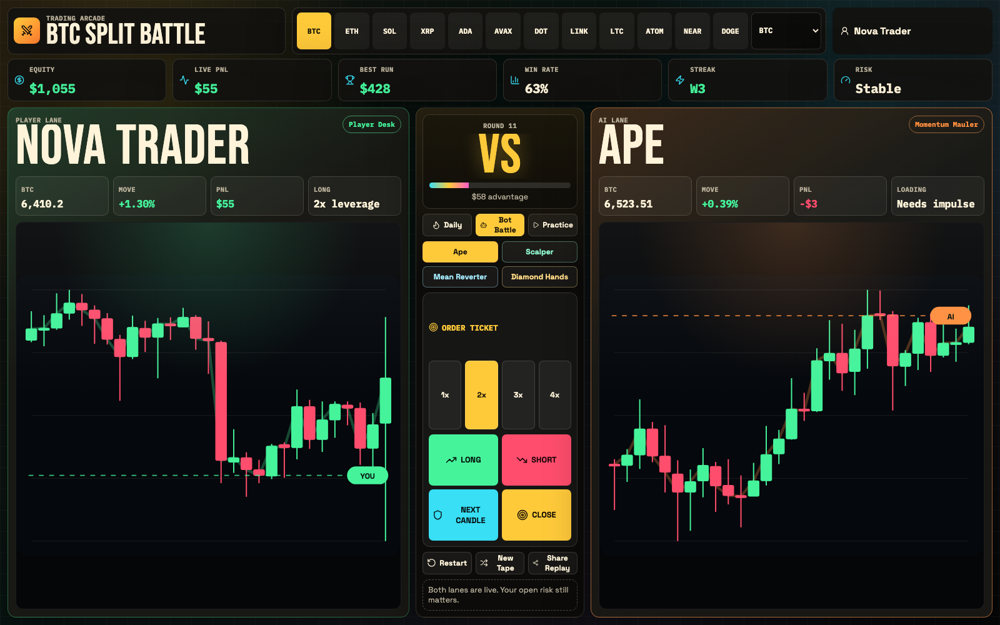
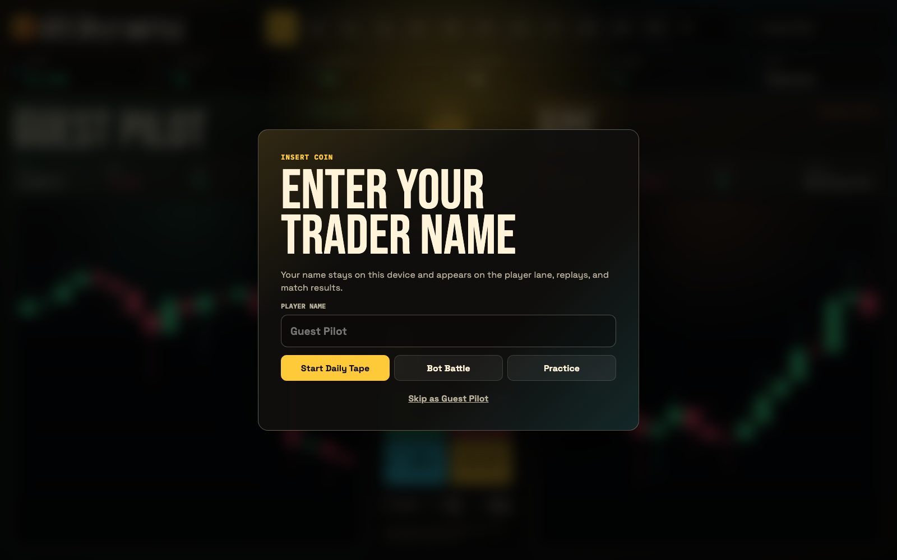
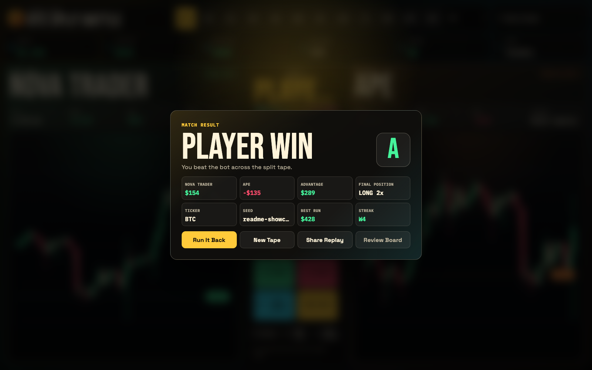

<div align="center">
  

  <h1>Trading Arcade</h1>

  <p>
    A guest-first browser trading game built from deterministic historical crypto candles.
    No login wall, no backend required, and every run is replayable from a seed.
  </p>

  <p>
    
    
    
  </p>
</div>

## What Is It?

Trading Arcade turns market candles into a fast arcade duel. The player controls the left chart lane, the NPC bot battles from the right lane, and each action advances the tape one candle at a time.

The current build is inspired by arcade cabinet and falling-block game pacing: readable rounds, immediate PnL feedback, replayable seeds, quick rematches, and a result screen built for sharing.

## Screenshots

### Insert Coin

First-time players enter a local-only trader name before launching a run.



### Split Battle

The player lane is on the left, the NPC lane is on the right, and the center console handles modes, bot selection, leverage, orders, restart, new tapes, and replay sharing.


### Match Result

Finished runs open an arcade-style summary modal with winner, grade, PnL, ticker, seed, final position, streak, and replay actions.



## Features

- Guest-first play with no account creation.
- Local player name, stats, unlocks, and progression stored in `localStorage`.
- Deterministic replay URLs with seed and ticker parameters.
- Player-left vs NPC-right split chart battle layout.
- Modes: `Daily`, `Bot Battle`, and `Practice`.
- Actions: `Long`, `Short`, `Next Candle`, and `Close`.
- Four explainable non-LLM bots: `Ape`, `Scalper`, `Mean Reverter`, and `Diamond Hands`.
- Bundled historical crypto candle data with a custom SVG chart renderer.
- Result modal with match grade, PnL comparison, final position, and replay controls.

## Local Setup

Requirements:

- Node.js 18+
- npm 9+

Install dependencies:

```bash
npm install
```

Run locally:

```bash
npm start
```

Test and build:

```bash
npm test
npm run build
```

The app runs entirely from the client workspace. No `.env` values are required for the default local experience.

## Gameplay Loop

1. Enter a trader name or skip as `Guest Pilot`.
2. Pick a mode, bot, ticker, and leverage.
3. Press an order button to resolve the next candle.
4. Beat the NPC bot by ending the run with higher PnL.
5. Review the result modal, run it back, load a new tape, or share the replay seed.

## Open-Source Notes

- The public build does not depend on `MONGO_URL`, `JWT_SECRET`, or `JWT_LIFETIME`.
- Legacy auth, profile, tournament, challenge, and proprietary charting surfaces are not part of the shipped runtime path.
- Replay state and player progression are stored locally in the browser.
- Historical candle JSON is bundled directly into the frontend, so the production JS bundle is intentionally large in the current architecture.

## Roadmap Ideas

- Risk-well pressure meter inspired by falling-block games.
- Profit clears, combo chains, and bot-generated garbage pressure.
- Keyboard-first controls for faster play.
- Mobile-first tabbed chart mode with a sticky order pad.
- Anonymous leaderboard mode without requiring accounts.
